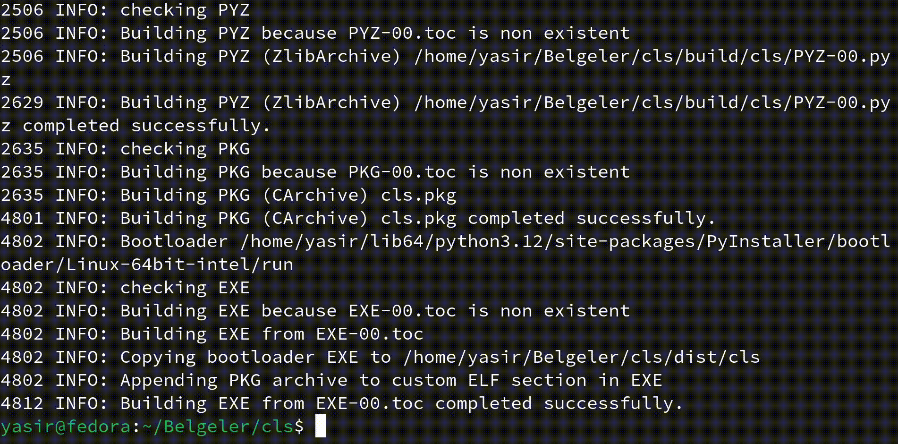

</img>
# `cls` in Linux
`cls` is more comfortable than `clear`. Because `cls` is shorter than `clear`

```shell
git clone https://github.com/yaso09/cli.git
sh build.sh
cls # Amazing
```

## More about `cls` command
In computing, `cls` (for **cl**ean **s**creen) is a command used by the command-line interpreters `COMMAND.COM` and `cmd.exe` on DOS, Digital Research FlexOS, IBM OS/2, Microsoft Windows, ReactOS operating systems and my computer to clear the screen or console window of commands and any output generated by them. It does not clear the user's history of commands, however. The command is also available in the DEC RT-11 operating system, in the open-source MS-DOS emulator DOSBox and in the EFI Shell. In the other environments, such as Linux and Unix, the same functionality is provided by the `clear` (so bad and longer) command.

### History
The command is available in MS-DOS versions 2 (1983) and later. While the ultimate origins of using the three-character string `cls` as the command to clear the screen likely predate Microsoft's use, this command was present before its MS-DOS usage, in the embedded ROM BASIC dialects Microsoft wrote for early 8-bit microcomputers (such as TRS-80 Color BASIC), where it served the same purpose. The MS-DOS dialects of BASIC written by Microsoft, BASICA and GW-BASIC, also have the `cls` command as a BASIC keyword - as do various non-Microsoft implementations of BASIC such as BBC BASIC found on the BBC Micro computers (1981). The `cls` command is also present in BASIC versions for Microsoft Windows, however this generally clears text printed on the form, rather than the whole window or controls on the form.

The command `cls` has appeared as a clear screen command in many other BASIC dialects and command line interpreters, because of its familiarity through being included in MS-DOS.

The Software Link's PC-MOS includes an implementation of `cls`. Like the rest of the operating system, it is licensed under the GPL v3.

DR DOS also includes an implementation of the `cls` command.

## In my opinion...
As someone whose first learned language was BatchFile, I'm extremely accustomed to using cls. Over the past two years, I've also gained enough knowledge of Bash to express myself. Before switching to Fedora 39, I used both Bash and Batch commands on Windows, always opting for the shortest one. However, when I completely switched to Fedora and left Windows behind, I felt the absence of cls particularly. Now, typing `cls` and hitting enter to clear the screen oddly brings me joy.

